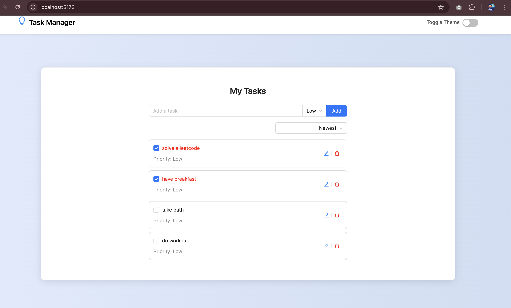

# 📝 To-Do App

A modern and responsive To-Do application built with React, Redux Toolkit, and Ant Design. This app helps you manage your tasks efficiently with features like light/dark mode, data persistence, and a clean user interface.

## 🌟 Features

- 🎨 **Light and Dark Mode**: Toggle between light and dark themes for better accessibility.
- 💾 **Data Persistence**: Tasks are saved using `localStorage`, ensuring your data is retained even after refreshing the page.
- 📱 **Fully Responsive**: Optimized for both mobile and desktop devices.
- 💡 **Modern UI**: Styled with Ant Design for a clean and professional look.

## 🖼️ Demo



## 📦 Tech Stack

- [React](https://reactjs.org/) - A JavaScript library for building user interfaces.
- [Redux Toolkit](https://redux-toolkit.js.org/) - State management for predictable and scalable applications.
- [Ant Design](https://ant.design/) - A modern UI library for React.
- [Vite](https://vitejs.dev/) - A fast development build tool.
- [localStorage](https://developer.mozilla.org/en-US/docs/Web/API/Window/localStorage) - Browser storage for persisting data.

## 🚀 Getting Started

### Prerequisites

Make sure you have the following installed:
- [Node.js](https://nodejs.org/) (v14 or higher)
- [npm](https://www.npmjs.com/) or [yarn](https://yarnpkg.com/)

### Installation

1. Clone the repository:
   ```bash
   git clone https://github.com/Vivek-aDev/to-do-app.git

2. Navigate to the project directory:
   ```bash
   cd your-repo-name

3. Install dependencies:
    ```bash
    npm install

### Running the App

1. Start the development server:
   ``` 
   npm run dev
2. Open your browser and navigate to http://localhost:3000.


## 🛠️ Project Structure
src/
├── components/    # Reusable UI components
├── features/      # Redux slices and logic
├── pages/         # Application pages
├── styles/        # Global and component-specific styles
├── utils/         # Utility functions
└── App.jsx        # Main application component